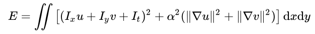

# horn-schunck
Simple C++ implementation of Horn-Schunck optical flow using OpenCV. 

**Note:**  
This implementation is written with a focus on clarity and mathematical transparency rather than low-level optimizations.  
But it should run in real-time on any CPU > then the year 2010.

The original paper can be found here: [Determining optical flow](https://www.sciencedirect.com/science/article/abs/pii/0004370281900242)


*Showing dense (hue) optical flow using horn-schunck method; Raw video taken from https://www.youtube.com/watch?v=zOq2XdwHGT0*


*Showing dense optical flow using horn-schunck method; Raw video taken from https://www.youtube.com/watch?v=zOq2XdwHGT0*

We calculate the optical flow by minimizing the energy in Equation (1).
For more details, see the [Horn-Schunck method](https://en.wikipedia.org/wiki/Horn%E2%80%93Schunck_method) on Wikipedia.


*Equation (1); Taken from https://en.wikipedia.org/wiki/Horn%E2%80%93Schunck_method*

## Usage
OpenCV, CMake, Make (and a compiler :D) is assumed to be installed.

(1) The CMakeLists.txt should look like this:

```cmake
cmake_minimum_required(VERSION 3.5)
project( horn-schunck )
find_package( OpenCV REQUIRED )
include_directories( ${OpenCV_INCLUDE_DIRS} )
add_executable( run run.cpp src/horn_schunck.cpp )
target_link_libraries( run ${OpenCV_LIBS} )
```

(2) Generate the executable, make sure your in the repository folder.
```bash
cmake .
make
```

(3.1) Run with internal webcam (if available; press any key to quit):
```bash
./run
```

(3.2) Run with video from file (press any key to quit):
```bash
./run your_video.avi
```

## Citations
```bibtex
@article{HORN1981185,
title = {Determining optical flow},
journal = {Artificial Intelligence},
volume = {17},
number = {1},
pages = {185-203},
year = {1981},
issn = {0004-3702},
doi = {https://doi.org/10.1016/0004-3702(81)90024-2},
url = {https://www.sciencedirect.com/science/article/pii/0004370281900242},
author = {Berthold K.P. Horn and Brian G. Schunck},
}
```